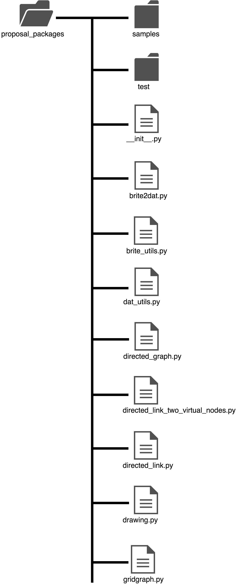

# about proposal packages

今後使う人がいるのか分かりませんが，自分への備忘録も兼ねて

## ライブラリの構成

proposal\_packagesは研究で使用する種々の機能をPythonのモジュール群にまとめたパッケージです．

各ファイルの簡単な説明を以下に示す．

* **sample** モジュールの使用例を示したファイルが置いてある いまのところ，方向性ラッパーのものしかない
* **test** モジュールのユニットテストを行うテストライブラリ いまのところ，双方向方向性ラッパーのものしかない
* **\_\_init\_\_.py** Pythonでディレクトリをモジュールとして認識させるために必要なファイル モジュールインポートする際，ここに書かれた処理が必ず実行されるが特に何も書いていない
* **brite2dat.py** BRITEが生成するbriteファイルを研究室でよく使うGLPKのdatファイルに変換したり，networkxでトポロジを描画する際に必要な位置座標を格納したcsvファイルを生成するコマンドラインツール 内部でbrite\_utils.pyを呼び出している
* **brite\_utils.py** briteファイルをパースしてノード，リンク，位置座標をPythonのデータ形式に変換するクラスと，それらをdatファイル，位置座標のcsvファイルに書き出す関数が定義されている
* **dat\_utils.py** datファイルをパースして各パラメータをPythonのデータ形式に変換するクラスが定義されている
* **directed\_graph.py** Graphillionで有向グラフに対して方向性を考慮したパス列挙を行えるようにするラッパー
* **directed\_link\_two\_virtual\_nodes.py** Graphillionで双方向リンクを持つグラフに対して方向性を考慮したパス列挙を行えるようにするラッパー 仮想ノードを2個追加する
* **directed\_link.py** Graphillionで双方向リンクを持つグラフに対して方向性を考慮したパス列挙を行えるようにするラッパー 仮想ノードを1個追加する
* **drawing.py** モデルデータのdatファイルと位置座標csvファイルを読み込んでモデルデータを描画するライブラリ
* **gridgraph.py** 格子グラフの生成と描画を行うライブラリ
* **graphillion\_utils.py** Graphillionにないがよく使う関数をまとめたライブラリ 作っている途中

