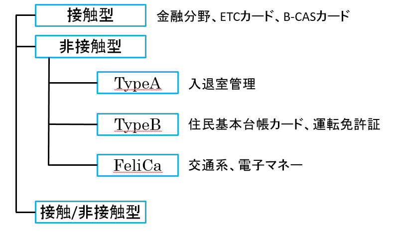

# ICカードマン

## ICカード

高機能のICチップを搭載したカード

ICカードの種類は以下のように分類できる

#### 接触型・・・高いセキュリティが求められる場合に利用される

#### 非接触型・・・素早いデータのやり取りが求められる場合に利用される

## ICカードの特徴

* 記録できるデータ量が多い

　　　磁気カードの約445倍

* セキュリティが高い

　　　耐タンパ―性

　　　タンパー（tamper）：干渉する;いじくる,いたずらする, 勝手に変えるの意

