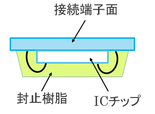

# ICカードマン

## ICカード

高機能のICチップを搭載したカード

集積回路\(IC:Integrated circuit\)・・・半導体チップの表面および内部に、複雑な機能を果たす電子回路の多数の素子が作り込まれている電子部品

## ICカードの特徴

* 記録できるデータ量が多い
* セキュリティが高い

　　　カード内の情報を不正に読み出すことができない

## ICカードの仕組み

### ICカードの構造的な仕組み

ICカードは「小さなコンピュータ」と呼ばれる。

ICカードに搭載されているICチップは下図のようパソコンと変わらないような構造になっている。

* **CPU\( Central Processing Unit\)**
* **コプロセッサ\( co-processor, 補助プロセッサ\)**
* **RAM\(Random access memory\)**
* **ROM\(Read only memory\)**
* **EEPROM\( Electrically Erasable Programmable Read-Only Memory\)**

上図のICチップをカード内に埋め込み、ICカードを作る。接触型の場合は、接続端子と一緒にカードに埋め込む。非接触型の場合は、ICチップとアンテナコイルと一緒に2枚のカード基材で挟み込むようにする。

### ICカードの動作的な仕組み

ICカード自体に電源はなく、そのままでは動作しない。そのため、カードリーダーから電力供給受けることで動作させる。接触型の場合は、接続端子が接触することにより動作電源が外部供給され動作する。非接触型の場合は、ゲー トに発生している磁界にカードがかざされると、ICカード内のアンテナコイルにより内 部に電圧が生じてカード側のICチップが作動する。

ICカードにおけるデータのやり取りは下図のようになる。このような方法をとることによって高いセキュリティを実現している。

### 耐タンパ―性

耐タンパ―性・・・内部構造の解析のしにくさ。

タンパ―（tamper）：干渉する;いじくる,いたずらする, 勝手に変えるの意

ICチップは偽造を目的としたあらゆる不正な解析行為に対する耐性を持つ。

#### 主な不正行為

①チップ解析\(物理的攻撃\)

ICチップをカードから取り出し、端子をあてる信号 検出などの電気的解析あるいは顕微鏡による観察など 物理的解析を行ないカード内情報を不正に読み出す。

② ICチップ動作時の信号統計解析\(論理的攻撃\)

ICチップの行なう処理によって変化する電力消費 量や処理時間等を測定し、統計的に解析することで カード内の情報を推測する。（信号統計解析）

#### 不正行為への対策

①に対しては・・・

*  チップ取り出し困難なカード構造（こじ開け時は破損する等）の採用
* チップ内の多層化、ダミー回路形成などによる物理的解析の困難化
* 異常検知センサなどによる電気的解析の困難化

具体的には・・・

* 封止樹脂をこじ開けると光が入り、メモリ内容が消去
* 多層配線構造により、メモリ回路端子が表面から観察できない
* メモリ素子の物理配置ランダム化
* 電圧異常、クロック異常等を検知すると、動作を停止

②に対しては・・・

* 回路の冗長な駆動による消費電力、処理時間の攪拌（均一化or不均一 化）などによる信号統計解析の困難化。

以下の攻撃に対して効果を発揮する。

* タイミング攻撃\(timing attack\)

　　暗号処理にかかる演算時間からアルゴリズムを予測する手法

* 電力解析攻撃\(power analysis attack\)

　　消費電力からアルゴリズムを予測する方法

* 電磁波解析攻撃\(TEMPEST\)

　　装置から漏洩する電磁波を解析する手法

## ICカードの種類

#### 接触型・・・高いセキュリティが求められる場合に利用される

　　　　　　金融分野、ETCカード、B-CASカード

#### 非接触型・・・素早いデータのやり取りが求められる場合に利用される

　　　　　　近接型が最も利用されている

* TypeA：入退室管理
* TypeB：住民基本台帳カード、運転免許証
* FeliCa：交通系、電子マネー

FeliCaはSonyが開発した非接触型ICカードの技術方式である。

処理が非常に高速で、処理の開始から終了までにかかる時間は0.1秒以内である。Suicaへ採用する方式の決定時に出された条件「0.1秒以内」をクリアすることができたのは、FeliCaだけだったらしいという逸話も。

日本では非接触型の約80%がFeliCaを使用している。

## ICカードの普及 

クレジットカードの利用が一般に広がっている。

カード情報の盗難、不正利用による被害額は年間で140億円\(2016\)

そこでカギになるのが偽造の難しい「ICクレジットカード」の普及である。

#### 現状 

国内のICカード普及率は70%だが、決済端末のIC対応が遅れている

#### 原因 

導入コストが高い

#### 対策 

一例として、POSシステムにおけるIC対応の低コスト化が挙げられる

2020年にはどちらも100%とすることを目標としている。

