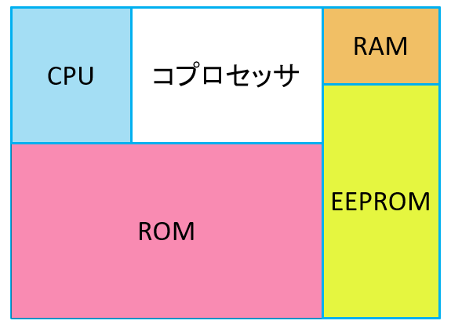

# ICカードマン

## ICカード

高機能のICチップを搭載したカード

集積回路\(IC:Integrated circuit\)・・・半導体チップの表面および内部に、複雑な機能を果たす電子回路の多数の素子が作り込まれている電子部品

## ICカードの特徴

* 記録できるデータ量が多い

　　　磁気カードの約455倍

* セキュリティが高い

　　　耐タンパ―性

　　　タンパー（tamper）：干渉する;いじくる,いたずらする, 勝手に変えるの意

## ICチップの仕組み

### ICカードの構造的な仕組み

ICカードは「小さなコンピュータ」と呼ばれる。

ICカードに搭載されているICチップは下図のようパソコンと変わらないような構造になっている。

#### CPU\( Central Processing Unit\)

ICカード内の処理を制御するICチップの心臓部

中央処理装置

#### ROM\(Read only memory\)

プログラムを格納するために使用する読み出し専用不揮発性メモリ

実行プログラムや暗号プログラムを格納

#### RAM\(Random access memory\)

一時的なデータを読み書きするための高速メモリ

データの作業領域として使用

#### EEPROM\( Electrically Erasable Programmable Read-Only Memory\)

主にデータを格納するために使用する書き換え可能な不揮発性メモリ

カード保持者の個人情報などを記録

#### コプロセッサ\( co-processor, 補助プロセッサ\)

CPUを強化する暗号処理用の演算装置

公開鍵暗号の演算を高速に処理するための専用プロセッサ

### ICカードの動作的な仕組み

## ICカードの種類

#### 接触型・・・高いセキュリティが求められる場合に利用される

#### 非接触型・・・素早いデータのやり取りが求められる場合に利用される

