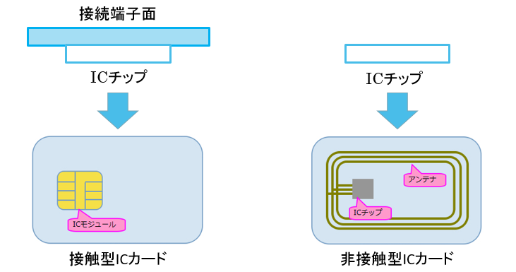

# ICカードマン

## ICカード

高機能のICチップを搭載したカード

集積回路\(IC:Integrated circuit\)・・・半導体チップの表面および内部に、複雑な機能を果たす電子回路の多数の素子が作り込まれている電子部品

## ICカードの特徴

* 記録できるデータ量が多い

　　　磁気カードの約455倍

* セキュリティが高い

　　　耐タンパ―性

　　　タンパー（tamper）：干渉する;いじくる,いたずらする, 勝手に変えるの意

## ICカードの仕組み

### ICカードの構造的な仕組み

ICカードは「小さなコンピュータ」と呼ばれる。

ICカードに搭載されているICチップは下図のようパソコンと変わらないような構造になっている。

* **CPU\( Central Processing Unit\)**
* **コプロセッサ\( co-processor, 補助プロセッサ\)**
* **RAM\(Random access memory\)**
* **ROM\(Read only memory\)**
* **EEPROM\( Electrically Erasable Programmable Read-Only Memory\)**

上図のICチップをカード内に埋め込み、ICカードを作る。接触型の場合は、接続端子と一緒にカードに埋め込む。非接触型の場合は、ICチップとアンテナコイルと一緒に2枚のカード基材で挟み込むようにする。

### ICカードの動作的な仕組み

ICカード自体に電源はなく、そのままでは動作しない。そのため、カードリーダーから電力供給受けることで動作させる。接触型の場合は、接続端子が接触することにより動作電源が外部供給され動作する。非接触型の場合は、ゲー トに発生している磁界にカードがかざされると、ICカード内のアンテナコイルにより内 部に電圧が生じてカード側のICチップが作動する。

ICカードにおけるデータのやり取りは下図のようになる。このような方法をとることによって高いセキュリティを実現している。

## ICカードの種類

#### 接触型・・・高いセキュリティが求められる場合に利用される

　　　　　　金融分野、ETCカード、B-CASカード

#### 非接触型・・・素早いデータのやり取りが求められる場合に利用される

　　　　　　近接型が最も利用されている

* TypeA：入退室管理
* TypeB：住民基本台帳カード、運転免許証
* FeliCa：交通系、電子マネー

FeliCaはSonyが開発した非接触型ICカードの技術方式である。

処理が非常に高速で、処理の開始から終了までにかかる時間は0.1秒以内である。Suicaへ採用する方式の決定時に出された条件「0.1秒以内」をクリアすることができたのは、FeliCaだけだったらしいという逸話も。

日本では非接触型の約80%がFeliCaを使用している。

