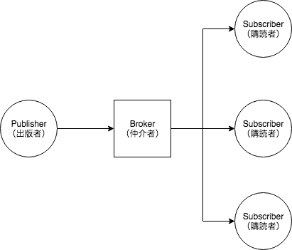

# IoT関連のプロトコル

## TODO

* IoT関連のプロトコルについて知識を蓄える
* HTTPのメソッドと，IoTでよく用いられるMQTTを知る
* プロトコルのレイヤも気にする

## HTTP\(HyperText Transfer Protocol\)

HTMLなどのコンテンツの送受信に用いられる通信プロトコル

アプリケーション層に位置する

### 代表的なメソッド

| メソッド | 動作 |
| :---: | :---: |
| GET | 指定されたURIのリソースを取り出す． |
| POST | クライアントがサーバにデータを送信する |
| PUT | 指定したURLのリソースを保存する |
| HEAD | サーバに対して，ヘッダーのみを要求 |
| DELETE | 指定されたURIのドキュメントを削除する |
| TRACE | サーバまでのネットワーク経路をチェックする |

## MQTT\(Message Queueing Telemetry Transport\)

メッセージ指向ミドルウェアのアプリケーション層で使用される，TCP/IPによる**Pub/Sub型データ配信モデル**の軽量なメッセージキュープロトコルである．  
非力なデバイスやネットワークが不安定な場所でも動作しやすい様に，メッセージ通信電文が軽量に設計されていることが特徴

### 特徴

* 軽量なプロトコルであり，シンプル
* 柔軟性の高いメッセージ配布ができる
* QoSレベルが3段階で指定できる
* メッセージ再配布機能がある
* ブローカーが最後に配布したメッセージは必ず保存する

### 構造

|  | 役割 |
| :---: | :---: |
| Publisher | メッセージを送信する（出版者） |
| Subscriber | メッセージを受け取る（購読者） |
| Broker | メッセージを仲介する（仲介者） |

### Pub/Sub型データ配信モデル

出版-購読型モデルは，非同期メッセージングパラダイムの一種であり，メッセージの送信者（出版側）が特定の受信者（購読側）を想定せずにメッセージを送るようプログラムされたものである．

**利点**

* 出版側と購読側は疎結合されており，相手の存在を知る必要もない．トピックに関して通信さえできれば，両者はネットワーク構成も知る必要がない．また，相手の状態がどうであろうと個々のシステムは正常に稼働し続ける．
* クライアント-サーバモデルよりも良いスケーラビリティを実現できる．

**欠点**

* 購読側がブローカー（サーバ）に対してメッセージ送信を要求するのは帯域内で行われ，セキュリティ問題が発生する可能性がある．購読側の正当性の検証をしない．

