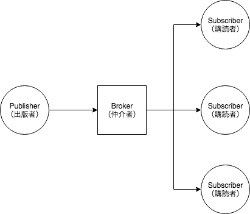
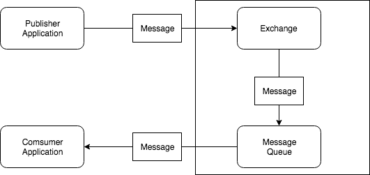
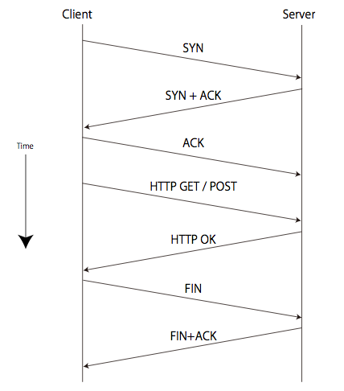
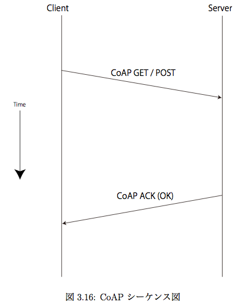
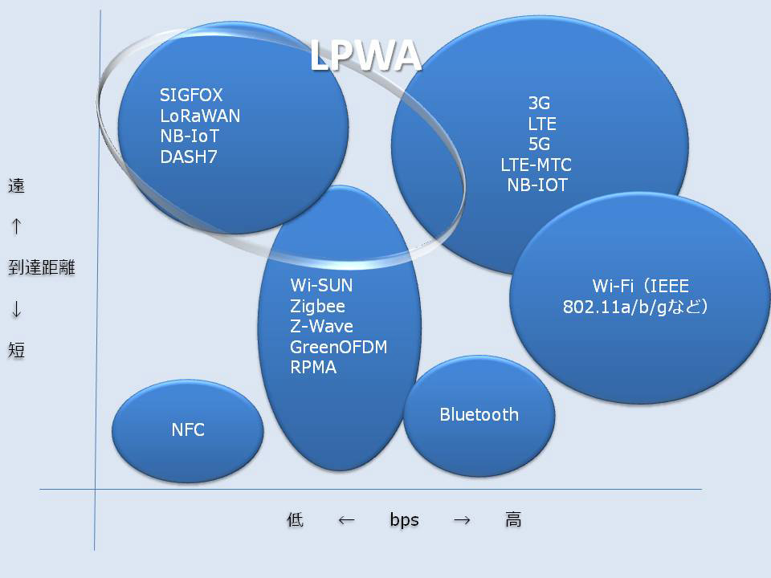
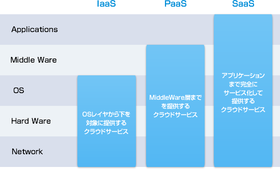

# Protocol/Radiocommunication/XaaS

## TODO

* [ ] IoT関連のプロトコルについて知識を蓄える
* [x] HTTPのメソッドと，IoTでよく用いられるMQTTを知る
* [ ] プロトコルのレイヤも気にする
* [x] 無線通信規格の特徴とメリットデメリットを知る
* [x] SaaSとかIaaSとかの違いについて知る

## プロトコル

### HTTP\(HyperText Transfer Protocol\)

HTMLなどのコンテンツの送受信に用いられる通信プロトコル

アプリケーション層に位置する

#### 代表的なメソッド

| メソッド | 動作 |
| :--- | :--- |
| GET | 指定されたURIのリソースを取り出す． |
| POST | クライアントがサーバにデータを送信する |
| PUT | 指定したURLのリソースを保存する |
| HEAD | サーバに対して，ヘッダーのみを要求 |
| DELETE | 指定されたURIのドキュメントを削除する |
| TRACE | サーバまでのネットワーク経路をチェックする |

#### ステータスコード

よく見るもの，見そうなもの

#### 1xx Informational 情報

| コード | 意味 |
| :--- | :--- |
| 100 Continue | 継続，クライアントはリクエストを継続できる |
| 102 Processing | 処理中 |

#### 2xx Success 成功

| コード | 意味 |
| :--- | :--- |
| 200 OK | リクエストが成功 |
| 201 Created | リクエストは完了し，新たに作成されたリソースのURLが返される |
| 202 Accepted | リクエストは受理されたが，処理は完了していない |
| 204 No Content | 内容なし． |

#### 3xx Redirection リダイレクション

| コード | 意味 |
| :--- | :--- |
| 305 Use Proxy | プロキシを使用せよ |

#### 4xx Client Error クライアントエラー

| コード | 意味 |
| :--- | :--- |
| 400 Bad Request | リクエストが不正である |
| 401 Inauthorized | 認証が必要である |
| 403 Forbidden | 禁止されている |
| 404 Not Found | 未検出 |

#### 5xx Server Error サーバーエラー

| コード | 意味 |
| :--- | :--- |
| 500 Internal Server Error | サーバー内部エラー |
| 502 Bad Gateway | 不正なゲートウェイ |

### MQTT\(Message Queueing Telemetry Transport\)

メッセージ指向ミドルウェアのアプリケーション層で使用される，TCP/IPによる**Pub/Sub型データ配信モデル**の軽量なメッセージキュープロトコルである．  
非力なデバイスやネットワークが不安定な場所でも動作しやすい様に，メッセージ通信電文が軽量に設計されていることが特徴

#### 特徴

* 軽量なプロトコルであり，シンプル
* 柔軟性の高いメッセージ配布ができる
* QoSレベルが3段階で指定できる
* メッセージ再配布機能がある
* ブローカーが最後に配布したメッセージは必ず保存する

#### 構造

|  | 役割 |
| :--- | :--- |
| Publisher | メッセージを送信する（出版者） |
| Subscriber | メッセージを受け取る（購読者） |
| Broker | メッセージを仲介する（仲介者） |

#### Pub/Sub型データ配信モデル

出版-購読型モデルは，非同期メッセージングパラダイムの一種であり，メッセージの送信者（出版側）が特定の受信者（購読側）を想定せずにメッセージを送るようプログラムされたものである．

**利点**

* 出版側と購読側は疎結合されており，相手の存在を知る必要もない．トピックに関して通信さえできれば，両者はネットワーク構成も知る必要がない．また，相手の状態がどうであろうと個々のシステムは正常に稼働し続ける．
* クライアント-サーバモデルよりも良いスケーラビリティを実現できる．

**欠点**

* 購読側がブローカー（サーバ）に対してメッセージ送信を要求するのは帯域内で行われ，セキュリティ問題が発生する可能性がある．購読側の正当性の検証をしない．

### AMQP\(Advanced Message Queueing Protocol\)

メッセージ指向ミドルウェアのオープンスタンダードなアプリケーション層プロトコル

#### メッセージングシステム

* Exchange
  * Exchangeは，生成されたMessageを受け取る役割を持つ．そのMessageはBindingに従って，適切なMessage Queueへ渡す．
* Binding
  * ExchangeとMessageQueueの対応づけを行う．
* Message Queue
  * Messageを蓄積し，Consumer Applicationに引き渡す役割を持つ．

Messageの大まかな流れ

1. Publisher Applicationによって生成されたMessageは，Exchangeに渡される．
2. ExchangeはBindingに基づいて，Messageを適切なMessage Queueに引き渡す．
3. Consumer Applicationによって，Message QueueからMessageが取り出される．

#### Exchangeについて

Exchangeは，設定された配送方法やbindingに従って，Message Queueにメッセージを配送する役割を持つ．  
Exchangeで指定可能な配送方法は以下の様なものがある．

* Direct
  * DirectなExchangeは，Messageに付与されているrouting keyと，bindingに設定されているbinding keyを見て，routing key = binding keyとなる様な，Message QueueにMessageを配送する．
* Fanout
  * FanoutなExchangeは，bindされているMessage Queue全てに受け取ったメッセージの配送を行います．
* Topic
  * Directと同じで，メッセージにrouting keyを指定して，そのkeyを元に配送するMessage Queueを選択する．

### CoAP（Constrained Application Protocol）

リクエスト/レスポンスモデルでのIoTデバイスとの通信に適したプロトコルであり，簡易的なHTTPという役割を持つ

UDPを用いているためレスポンスがシンプルであり，HTTPヘッダは50byteあるのに対し，CoAPは4byteである

シーケンスの比較は以下の図の通りである

## 無線通信規格

**PAN（Personal Area Network）**

人間の周りの機器をネットワークとする範囲として，10〜20m程度をカバーするもの

**Wi-Fi（Wireless Fidelity）**

無線LAN規格のIEEE802.11を使用していることを示すために発行している認証

**Bluetooth**

近距離無線通信を想定して作られた規格

Wi-Fiが約100mの通信距離を持つのに対して，数mから数十m程度と通信距離が短く，また通信速度もやや劣るが，省電力であることが特徴である．

| ネットワーク | 標準化機関 | 例 |
| :--- | :--- | :--- |
| 短距離無線 | 通信方式ごとに個別 | RF-ID，DSRC，NFC |
| 無線PAN | IEEE802.15 | Blutooth，ZigBee |
| 無線LAN | IEEE802.11 | IEEE802.11b/a/g |
| 無線MAN | IEEE802.16，802.20 | Flash-OFDM |
| 無線WAN | 3GPP，3GPP2 |  |

### LPWA（Low Power Wide Area）

低消費電力，広範囲を特徴とする無線通信技術の総称

Bluetoothや無線LAN，LTEは，長距離伝送や低消費電力，低コスト運用といったIoT/M2Mで求められる要件を全て満たすものでないため，それらを満たすために考案された．

有名なものとして，SIGFOX，LoRaWAN，Wi-SUN，NB-IoTといったものがある．

SIGFOXやLoRaWAN，Wi-SUNは「非セルラー系LPWA」と呼ばれ，基本的に免許がいらないISMバンド（日本では920MHz帯）を利用する．それに対してNB-IoTはLTE技術をベースに，IoTでの利用に向けたカスタマイズが行われている「セルラー系LPWA」と言える

**セルラー**

区画ごとにエリアを分割し，そこに基地を配置して無線通信を行う方式のこと．電波の干渉を防ぐために，隣接する区画ごとに違う周波数を使っている．

携帯電話はセルラー方式を用いている．

|  | 到達距離（最大） | 伝送速度 | 利用帯域（日本） |
| :--- | :--- | :--- | :--- |
| SIGFOX | 数十km | 100bps | 920MHz帯 |
| LoRaWAN | 11km | 290bps〜50kbps | 920MHz帯 |
| Wi-SUN | 1km | 200kbps | 920MSz帯 |
| NB-IoT | 15? | 150kbps | LTEバンド |

#### SIGFOX

仏Sigfoxが開発した．最も特徴的なのは上りしか通信しないこと．帯域はUNB（Ultra Narrow Band：超狭帯域）を用い，日本国内では920MHz帯を利用する．最安で端末1台あたり年100円

#### LoRaWAN

非営利団体のLoRa Allianceが主導して規格策定などを行なっているLPWA技術で，基本的にはSIGFOXと同様でUNBを利用しており，ISM帯を使う．

主な賛同企業としてはIBMやCisco．Orange，STMMicroelectronicsなどがあり，日本国内ではMVNOのそらコムが実証実験を行っている．

#### NB-IoT

携帯電話向け無線規格を策定する標準化団体「3GPP」が策定を進めている．

LTEを低速・低消費電力・低価格で実現できるようにしたもの．

LTEの1キャリア内で1スロットをNB-IoTに振り分けても，IoT全体のトラフィックは6%程度にしかならず，1スロットで需要を純分賄えるため，既存LTEネットワークへの悪影響も心配ない．既存LTEとの完全な互換性があるわけではなく，基地局にも新たなソフトウェアを導入する必要があるが，既存きち今日がそのまま利用できるというメリットもある．

## XaaS（X as a service）

XaaSとは，情報処理に用いられる何らかのコンピュータ資源を，あるいはそうした資源の全てを，インターネットを通じたサービスとして提供することである．

XaaSを利用することで，従来は製品の購入・システムの構築・インフラの敷設などを必要とした高コストのコンピューティング資源を，インターネットを通じて必要な分のみ利用することができる．

Xの部分は未知の値を指し，SaaS，PaaS，IaaS，HaaSなどある

#### SaaS：Software

これまでパッケージ製品として提供されていたソフトウェアを，インターネット経由でサービスとして提供・利用する形態

例:Gmail，Yahooメール

#### PaaS：Platform

アプリケーションソフトが稼働するためのハードウェアやOSなどのプラットフォーム一式を，インターネット上のサービスとして提供する形態

例:Microsoft Azure，Google App Engine， Heroku，IBM Bluemix

#### IaaS：Infrastructure（別名HaaS：Hardware）

情報システムの稼働に必要な仮想サーバをはじめとした機材やネットワークのインフラを，インターネット上のサービスとして提供する形態

例:Xサーバーなどのレンタルサーバー，Amazon Elastic Compute Cloud，Google Compute Engine

#### DaaS:Desktop

パソコンのデスクトップ環境をクラウドで作って，インターネットを通じて利用するサービス

例:Microsoft Virtual Desktop，IBM Smart Business Desktop

