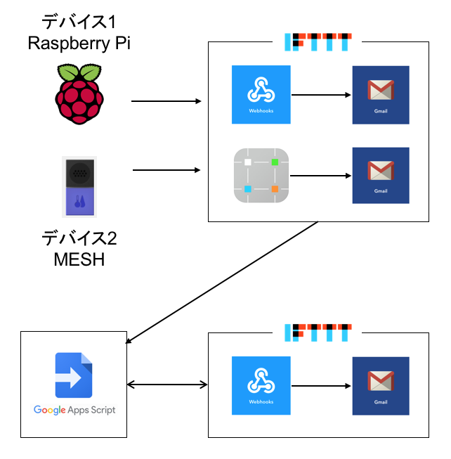
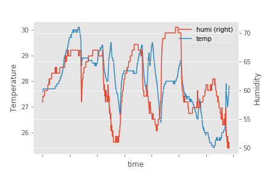

# Memo

## 2018.5.18

### 別々なデバイスからの通知のAND化の提案



```javascript
var FindSubjectRaspberry = 'subject:(raspberrypi) ';
var FindSubjectMESH = 'subject:(MESH) ';

function getMail() {
  // 指定した件名のスレッドを検索して取得
  var raspiThreads = GmailApp.search(FindSubjectRaspberry, 0, 5);
  var meshThreads = GmailApp.search(FindSubjectMESH, 0, 5);

  // スレッドからメールを取得し二次元配列に格納
  var raspiMessages = GmailApp.getMessagesForThreads(raspiThreads);
  var meshMessages = GmailApp.getMessagesForThreads(meshThreads);

  for(var i in raspiMessages){
    for(var j in raspiMessages[i]){
      // スターがないメッセージのみ処理
      if(!raspiMessages[i][j].isStarred() && !meshMessages[i][j].isStarred()){

        // IFTTTでメールを送る
        sendHttpPost()

        // 処理済みのメッセージにスターをつける
        raspiMessages[i][j].star();
        meshMessages[i][j].star();
      }
    }
  }
}

function sendHttpPost(){
  var options = 
      {
        "method" : "post",
      };

  UrlFetchApp.fetch("https://maker.ifttt.com/trigger/event/with/key/api_key", options);
}
```

## 2018.5.25

### IFTTTを介してできること，提案

テレビを見ている : MESHの明るさタグ

## 2018.6.1

### IFTTTを複数介した研究探し

微妙なものしかなかった

## 2018.8.2

### 温湿度の可視化

1. MESHからIFTTTを介してGoole スプレッドシートへ書き込む
2. APIを叩いてスプレッドシートの中身を入手
3. matplotlibを用いてグラフ化



## 2018.10.25

* 高松市で見守りシステムのAI導入事例
* 富士通の見守りシステム

## 2018.10.26

* 湿度センサ逝かれました
* RaspberryPiにDropboxのアップローダー入れた（手順はRaspberry Piのページに）
* cronで定期的にログをDropboxに送るようにした



### 参考

* pythonでスプレッドシートを扱う  

[https://qiita.com/akabei/items/0eac37cb852ad476c6b9](https://qiita.com/akabei/items/0eac37cb852ad476c6b9)

* matplotlibで複数のグラフを扱う  

[https://qiita.com/ynakayama/items/68eff3cb146181329b48](https://qiita.com/ynakayama/items/68eff3cb146181329b48)

