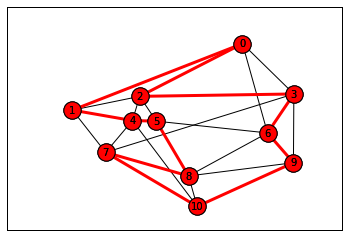

# Graphillion\_seminar

## TODO

~~描画例のスクリプトを作る~~

~~学部生が描画できるように各モデルデータのノード座標の辞書データを記載しておく~~

~~解答例を作る。描画処理は共通化できるので関数にまとめておく~~

ライブラリの導入方法とかバージョン確認法とかも書いたほうがいいんじゃないかと思った

来年度はjupyter notebook上で解いてもらったり、発表時もjupyterで実演してもらいながら実行結果をリアルタイムで見せてもらいたい

## 引っかかったところ

### エラーは出ないがグラフが描画されない

`nx.Graph`**に辺のリストを渡して初期化するオプショナルな第1引数名が1.xと2.xで変更されていることが原因だった。**

1.xでは`data`だが2.xは`incoming_graph_data`になっている。存在しない引数名を指定すれば当然エラーが発生するが、`nx.Graph`の場合、第2引数が残りすべての引数を辞書型で受け取る特別な引数`**attr`となっているため、任意の名前のオプショナルな引数を渡しても文法的に正しくエラーが発生しない。これのせいで、延々と`data=edgelist`とか渡して、初期化されないグラフオブジェクトを眺めて辛い思いをする羽目になった。

networkxではかなり多くのクラスやメソッドが`**attr`で引数を受け取ってグラフ、ノード、エッジに属性を与える機能を提供している。引数名を正しく把握していないと本来渡したいデータが意味のない属性として解釈されバグの原因になる。こうならないためにはリファレンス等を見て、使っているバージョンでの正確な引数名を把握するしかない。

## 準備

すべての問題でグラフを描画するので、描画に必要なライブラリのnetwrokxとmatplotlibを使えるようにしておくこと。anacondaでPython環境を作っている場合はすでに入っているはず。

2018.6.12時点でのライブラリバージョンは以下の通り

* networkx 2.1
* matplotlib 2.2.2

バージョン差で描画の仕様が若干変わっているので上記バージョンを入れてもらう。

描画する際は以下の例を参考にすること。



ベースとなるグラフのノード、リンクは黒で、描画対象の部分グラフはノード、リンクを赤などの色で強調する。matplotlibのバージョンの関係から上記の例と見た目が微妙に異なって描画される場合があるが仕様なので気にしなくてよい。

例としてノード数4の完全グラフを描画するスクリプトを示す。

```python
import networkx as nx
import matplotlib.pyplot as plt

edgelist = [(1, 2), (1, 3), (1, 4), (2, 3), (2, 4), (3, 4)]
node_pos = {1: (0, 0), 2: (1, 1), 3: (1, -1), 4: (2, 0)}
G = nx.Graph(incoming_graph_data=edgelist)

nx.draw_networkx_nodes(G, node_pos, node_color="w")
nx.draw_networkx_labels(G, node_pos)
nx.draw_networkx_edges(G, node_pos)

subgraph = nx.Graph(incoming_graph_data=[(1, 2), (2, 4)])
nx.draw_networkx_nodes(subgraph, node_pos, node_color="r")
nx.draw_networkx_labels(subgraph, node_pos)
nx.draw_networkx_edges(subgraph, node_pos, edge_color="r", edgelist=subgraph.edges(), width=3.0)

plt.xticks([])
plt.xticks([])

plt.show()

```

### M1が注意すること

* **チュートリアルは問題から外して全員が共通して取り組むようにすること**
* **A班に取り組んでもらった際にモデルデータの画像がゼミのフォルダに入っていなかったので、必ず入れておく。画像は去年のゼミのフォルダの中に入っている**

## 描画関数

何度も描画処理を書くのは面倒なので解答例で共通して使用する描画関数`mydraw`を定義する。



```python
import networkx as nx
import matplotlib.pyplot as plt

def mydraw(G, pos, subgraph=None, with_edge_label=False):
    """
    グラフGを描画する
    subgraphを与えると、その部分を赤色で強調して描画する
    with_edge_labelをTrueとすると辺に重みをつけて描画する
    ただしGを辺重み付きグラフとして定義していなければならない

    arguments:
    * G(networkx Graph)
    * pos(dict)
      キーがノード、値が位置座標を表すタプルの辞書
    * subgraph(edgelist, optional)
      部分グラフの辺のリスト
    * with_edge_label(bool, optional)
      辺重みを描画するかどうかのフラグ
    """
    nx.draw_networkx_nodes(G, pos, node_color="w")
    nx.draw_networkx_labels(G, pos)
    nx.draw_networkx_edges(G, pos)

    if with_edge_label:
        edge_labels = {(i, j): data["weight"] for i, j, data in G.edges(data=True)}
        nx.draw_networkx_edge_labels(G, pos, edge_labels=edge_labels)

    if subgraph is not None:
        subgraph = nx.Graph(incoming_graph_data=subgraph)
        nx.draw_networkx_nodes(subgraph, pos, node_color="r")
        nx.draw_networkx_labels(subgraph, pos)
        nx.draw_networkx_edges(subgraph, pos, edge_color="r", edgelist=subgraph.edges(), width=3.0)

    plt.xticks([])
    plt.yticks([])

    plt.show()
```



`mydraw.py`はモジュールとして使用する。つまり各問題のプログラム先頭で以下のように宣言して`mydraw`関数を使用できるようにする。ただし、`mydraw.py`と各問題のプログラムは同じディレクトリに存在しているものとする。

```python
from mydraw import mydraw
```

## 問題1 特定の部分グラフの求め方

グラフを自分で作成し、以下の部分グラフを求めよ。また各部分グラフを1つずつ描画せよ。

* 全域木
* すべての2頂点間のすべてのハミルトン路
* ハミルトン閉路



```python
from itertools import combinations
import networkx as nx
from graphillion import GraphSet

from mydraw import mydraw

edgelist = [(1, 2), (1, 3), (1, 4), (2, 3), (2, 4), (3, 4)]
nodes = [1, 2, 3, 4]
node_pos = {1: (0, 0), 2: (1, 1), 3: (1, -1), 4: (2, 0)}
G = nx.Graph(incoming_graph_data=edgelist)
GraphSet.set_universe(edgelist)

# 全域木
print("全域木")
spanning_trees = GraphSet.trees(is_spanning=True)
print("本数 {}".format(len(spanning_trees)))
for tree in spanning_trees:
    print(tree)
else:
    print()

mydraw(G, node_pos, subgraph=spanning_trees.choice())

# 任意の２頂点間のハミルトン路
print("ハミルトン路")
choiced_hamilton_path = []
for i, j in combinations(nodes, 2):
    hamilton_paths = GraphSet.paths(i, j, is_hamilton=True)
    print("頂点の組 {} {}".format(i, j))
    print("本数 {}".format(len(hamilton_paths)))
    for path in hamilton_paths:
        print(path)
    else:
        choiced_hamilton_path = hamilton_paths.choice()
        print()

mydraw(G, node_pos, subgraph=choiced_hamilton_path)

# ハミルトン閉路
print("ハミルトン閉路")
hamilton_cycles = GraphSet.cycles(is_hamilton=True)
print("本数 {}".format(len(hamilton_cycles)))
for cycle in hamilton_cycles:
    print(cycle)

mydraw(G, node_pos, subgraph=hamilton_cycles.choice())
```



## 問題2 モデルデータのパス導出

モデルデータcost239、nsfnet、jpn12、akitaから1つ選び、そのモデルのすべての2頂点間のパスの本数を求めよ。また、2頂点の組を1つ選びパスを1本描画せよ。

また、すべての2頂点間のパスのうち、特定の1つのノードを含まないパスの本数を求めよ。この結果も先ほどと同様に描画せよ。

モデルデータは実在する都市をノード、交通網などをリンクとしている。描画の際は都市の緯度・経度をノードの位置座標とすることで綺麗に描画できる。以下に各モデルデータのノードの緯度・経度の辞書データを示す。



```text
cost239 {0: (12.568337099999999, 55.676096799999996), 1: (-0.12775830000000002, 51.507350899999999), 2: (4.8951679000000015, 52.370215700000003), 3: (16.404954, 52.520006599999988), 4: (4.3517102999999997, 50.850339599999998), 5: (6.1295829999999984, 50.815272999999998), 6: (14.4378005, 50.075538100000003), 7: (2.3522218999999995, 48.856614), 8: (8.5416939999999997, 47.376886600000006), 9: (16.3738189, 48.208174299999996), 10: (9.1859242999999999, 45.465421899999996)}

nsfnet {0: (-122.33207079999998, 47.606209499999999), 1: (-122.14301950000001, 37.441883399999995), 2: (-117.1610838, 32.715738000000002), 3: (-95.369802799999988, 29.7604267), 4: (-111.89104740000002, 40.760779299999996), 5: (-105.27054560000001, 40.014985600000003), 6: (-96.685198200000002, 40.825762500000003), 7: (-88.2433829, 40.116420399999996), 8: (-84.387982399999999, 33.748995399999998), 9: (-79.995886400000003, 40.440624799999988), 10: (-83.743037799999996, 42.2808256), 11: (-76.501880700000001, 42.443961399999999), 12: (-76.937759999999997, 38.989696700000003), 13: (-74.650897299999997, 40.361410499999998)}

jpn12 {0: (141.35437630000001, 43.062095800000002), 1: (140.86935580000002, 38.268215000000005), 2: (139.73199250000002, 35.709025899999993), 3: (139.31580559999998, 35.666339399999998), 4: (136.65620509999999, 36.561325400000008), 5: (138.18095569999997, 36.651298600000004), 6: (136.906398, 35.181446399999999), 7: (135.50216509999998, 34.693737799999994), 8: (132.4552927, 34.385202899999996), 9: (132.7655752, 33.839157399999998), 10: (130.4148783, 33.591357599999988), 11: (127.6791568, 26.212312399999998)}

akita {0: (140.78843610000001, 40.215777799999998), 1: (140.56428540000002, 40.271405000000001), 2: (140.3707417, 40.2260542), 3: (140.02662380000001, 40.212150799999996), 4: (140.1023643, 39.718613500000004), 5: (139.84755800000002, 39.886817700000002), 6: (140.01305400000001, 39.857287599999999), 7: (140.04879059999999, 39.385876600000003), 8: (139.90771269999999, 39.203011600000004), 9: (140.47544809999999, 39.453088200000003), 10: (140.73058810000001, 39.700069399999997), 11: (140.56664880000002, 39.313781599999999), 12: (140.49566289999999, 39.164304100000003)}
```



```text
表示例
すべての2頂点間のパス本数
start 1, target 2, number of paths ???
start 1, target 3, number of paths ??? 
.
.
.

特定の1ノードを含まないパス本数
start 1, target 2, excluded 3, number of paths ???
start 1, target 2, excluded 4, number of paths ???
.
.
.
```



```python
"""
ここではcost239を使用する
"""

from itertools import combinations
import networkx as nx
from graphillion import GraphSet

from mydraw import mydraw

# Graphilionはリンク(i,j)と(j,i)を区別しないので
# 例えば，cost239の場合ノード0,1間のリンクは(0,1)または(1,0)のどちらで定義してもよい
edgelist = [(0, 1),
            (0, 2),
            (0, 3),
            (0, 6),
            (1, 2),
            (1, 4),
            (1, 7),
            (2, 3),
            (2, 4),
            (2, 5),
            (3, 6),
            (3, 7),
            (3, 9),
            (6, 5),
            (6, 8),
            (6, 9),
            (4, 5),
            (4, 7),
            (4, 10),
            (7, 8),
            (7, 10),
            (5, 8),
            (9, 8),
            (9, 10),
            (10, 8)]
nodes = [0, 1, 2, 3, 4, 5, 6, 7, 8, 9, 10]
G = nx.Graph(incoming_graph_data=edgelist)
cost239_node_pos = {0: (12.568337099999999, 55.676096799999996),
                    1: (-0.12775830000000002, 51.507350899999999),
                    2: (4.8951679000000015, 52.370215700000003),
                    3: (16.404954, 52.520006599999988),
                    4: (4.3517102999999997, 50.850339599999998),
                    5: (6.1295829999999984, 50.815272999999998),
                    6: (14.4378005, 50.075538100000003),
                    7: (2.3522218999999995, 48.856614),
                    8: (8.5416939999999997, 47.376886600000006),
                    9: (16.3738189, 48.208174299999996),
                    10: (9.1859242999999999, 45.465421899999996)}

GraphSet.set_universe(edgelist)

# 任意の２頂点間のパスの本数
for i, j in combinations(nodes, 2):
    paths = GraphSet.paths(i, j)
    print("{},{}間のパスの本数: {}".format(i, j, len(paths)))
else:
    print()
# 描画するパスは0,10間のパスの1つ
choiced_path = GraphSet.paths(0, 10).choice()
mydraw(G, cost239_node_pos, subgraph=choiced_path)

# 特定の１つのノードを含まないパスの本数
for i, j in combinations(nodes, 2):
    excluding_nodes = set(nodes) - {i, j}
    for e in excluding_nodes:
        paths = GraphSet.paths(i, j).excluding(e)
        print("{},{}間のパスのうち{}を除外したパスの本数: {}".format(i, j, e, len(paths)))
choiced_path_excluding = GraphSet.paths(0, 10).excluding(9).choice()
mydraw(G, cost239_node_pos, subgraph=choiced_path_excluding)
```



## 問題3 重み付き辺の列挙

重み付きグラフを作成し、辺重みの降順で1組の2頂点間のパスを列挙せよ。また、各パスの重みの和も求めよ。

降順で取り出したパスの3本目までを辺重みもグラフに示して描画せよ。



```python
import networkx as nx
from graphillion import GraphSet

from mydraw import mydraw

edgelist = [(1, 2, 10), (1, 3, 20), (1, 4, 30), (2, 3, 40), (2, 4, 50), (3, 4, 60)]
nodes = [1, 2, 3, 4]
node_pos = {1: (0, 0), 2: (1, 1), 3: (1, -1), 4: (2, 0)}
G = nx.Graph()
G.add_weighted_edges_from(edgelist)
GraphSet.set_universe(edgelist)

cost_table = {(i, j): cost for i, j, cost in edgelist}

for i, path in enumerate(GraphSet.paths(1, 4).max_iter()):
    total_cost = sum([cost_table[edge] for edge in path])
    print("path", path, "total_cost", total_cost)
    if i < 3:
        mydraw(G, node_pos, subgraph=path, with_edge_label=True)
```



## 問題4 ノード次数の導出

ノードの次数とはノードに接続している辺の本数のことである。例えば、cost239のノード0の次数は4である。

グラフを自分で作成し、graphillionが提供しているメソッドのみを用いてすべてのノードの次数を求めよ。また、このとき必要な部分グラフを描画せよ。

**難しいかもしれないのでヒント（ほぼ答えになっている気がする）**

全サブグラフのうち、あるノードを含み、かつ辺の本数が1であるようなサブグラフを求めてみると...



```python
"""
ノードの次数とは、あるノードに接続している辺の数である。
これを部分グラフで表現すれば、あるノードを含む辺の数が1の部分グラフの本数といえる。
graphillionでこれを実現するためには以下のgraphillionのメソッドを組み合わせれば良い。
* 特定ノードを含むグラフセットを返すincluding
* 指定した辺の数を持つグラフセットを返すgraph_size
* 指定したグラフセットの要素数を返すlen
"""

import networkx as nx
from graphillion import GraphSet

from mydraw import mydraw

def degree_subgraph(node):
    """
    すべての部分グラフのうち、nodeを含み辺の数が1の部分グラフを返す
    """
    return GraphSet({}).including(node).graph_size(1)

def degree(node):
    """
    nodeの次数を返す
    """
    return len(degree_subgraph(node))

edgelist = [(1, 2), (1, 3), (1, 4), (2, 4), (3, 4)]
nodes = [1, 2, 3, 4]
node_pos = {1: (0, 0), 2: (1, 1), 3: (1, -1), 4: (2, 0)}
G = nx.Graph(incoming_graph_data=edgelist)
GraphSet.set_universe(edgelist)

for n in nodes:
    print("ノード{}の次数: {}".format(n, degree(n)))
    for subgraph in degree_subgraph(n):
        mydraw(G, node_pos, subgraph=subgraph)
```



