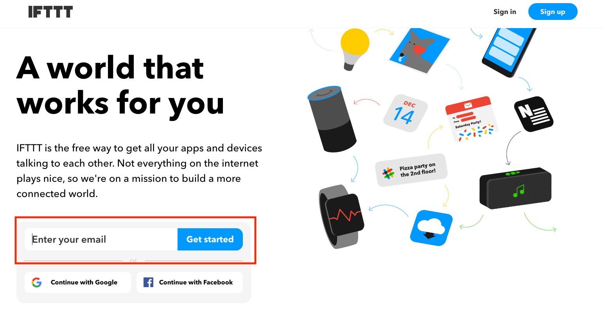
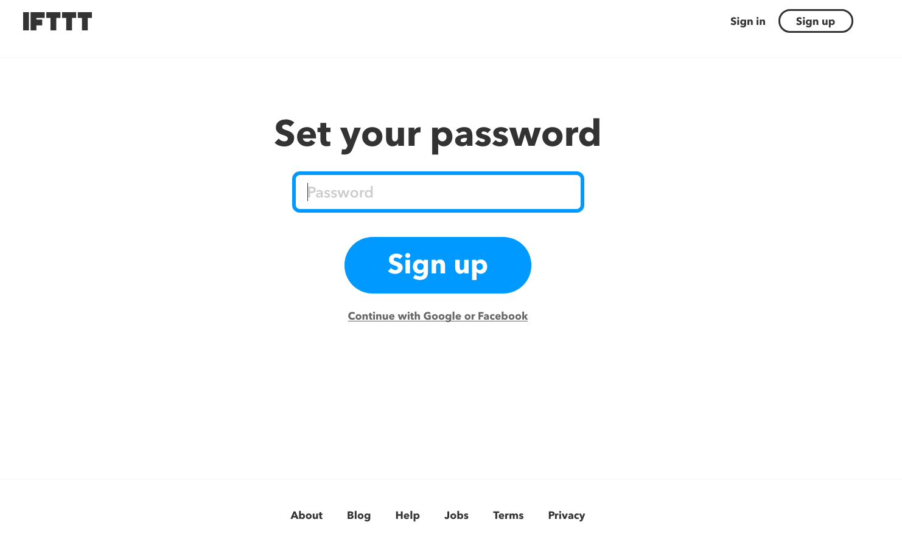
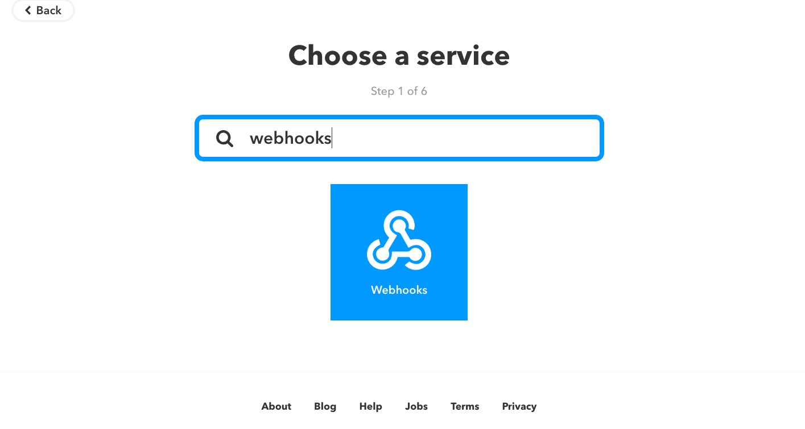
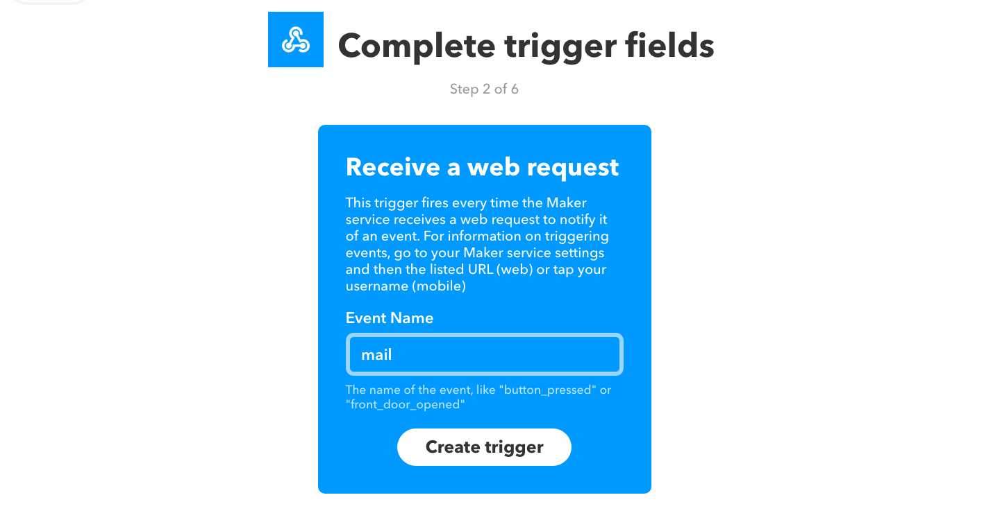
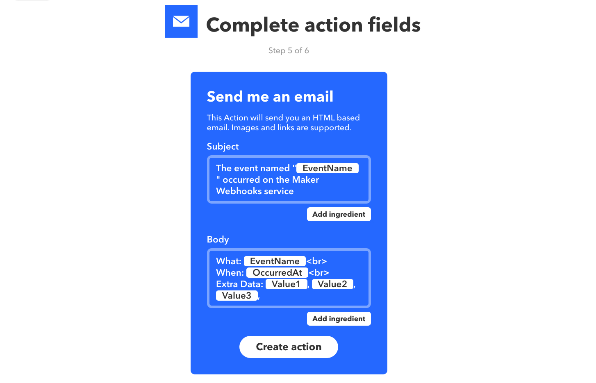
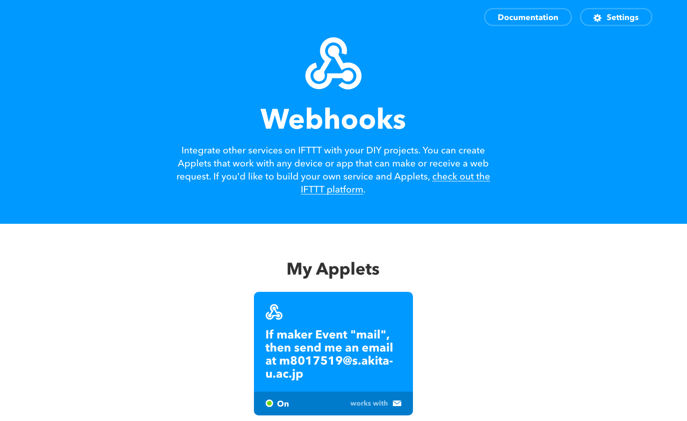
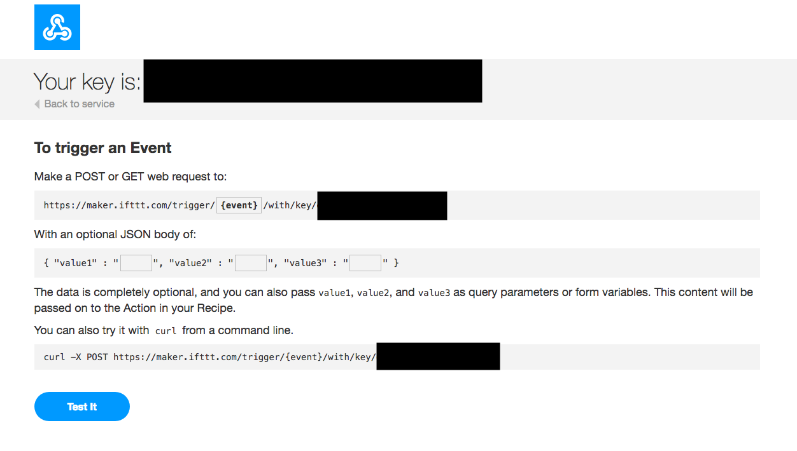

# IFTTT\_seminar

## IFTTTゼミ

### 今回のゼミの内容

* IFTTTとは
* IFTTTアカウント作成
* レシピ作成・通知
* 課題演習

### IFTTTとは

> 「レシピ」と呼ばれる個人作成もしくは公に共有しているプロフィールを使って数あるWebサービス（Facebook、Evernote、Weather、Dropboxなど）同士で連携することができるWebサービスである．  
> 「if this then that」というシンプルなコンセプトに基づく「レシピ」を作成し共有することができる．
>
> [Wikipedia（日本語訳 ）](https://ja.wikipedia.org/wiki/IFTTT)

### アカウント作成

* IFTTT.comにアクセス
* 赤枠のところに自分のメールアドレス（大学のメールアドレスで可）を入力して

  

+ 任意のパスワードを入力しSign upをクリックするとアカウントが作成できる

## レシピ作成

### Webhooksとメールの連携

+ [IFTTT.com](https://ifttt.com/)にアクセスし，右上のユーザの部分をクリックしNew Appletを選択
+ 青字のthisをクリック
+ 検索欄にWebhooksを入力しクリック

+ Receive a web requestを選択
+ 任意のイベント名（ここではmail）を入力し，Create triggerをクリック

  

+ 次にthatではEmailをクリックし，Send me an emailを選ぶ

+ デフォルトのままCreate actionをクリック
+ Finishをクリックし，レシピ作成が完了
 
### メール送信

+ IFTTTのトップページのSearchからWebhooksを検索する
+ 右上のDocumentationをクリック

  

+ 各々のkeyが示されていることが確認できる（画像の黒塗りの部分）

  

+ Make a POST or GET web request to: の下にあるeventの部分に作成したイベント名を入力し，最下段のTest Itをクリック
+ 登録した時のメールアドレスにメールが来たことを確認する

## 課題演習

+ 例に示したレシピにおいて題名や本文を変更してみる
+ 任意のレシピを作成する

