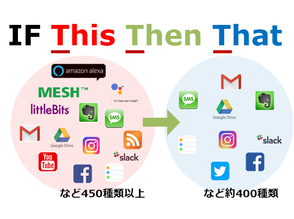

# IFTTT\_seminar

## IFTTTゼミ

### 今回のゼミの内容

* IFTTTとは
* IFTTTアカウント作成
* レシピ作成・通知
* 課題演習

### IFTTTとは

> 「レシピ」と呼ばれる個人作成もしくは公に共有しているプロフィールを使って数あるWebサービス（Facebook、Evernote、Weather、Dropboxなど）同士で連携することができるWebサービスである．  
> 「if this then that」というシンプルなコンセプトに基づく「レシピ」を作成し共有することができる．
>
> [Wikipedia（日本語訳 ）](https://ja.wikipedia.org/wiki/IFTTT)

### アカウント作成

* IFTTT.comにアクセス

